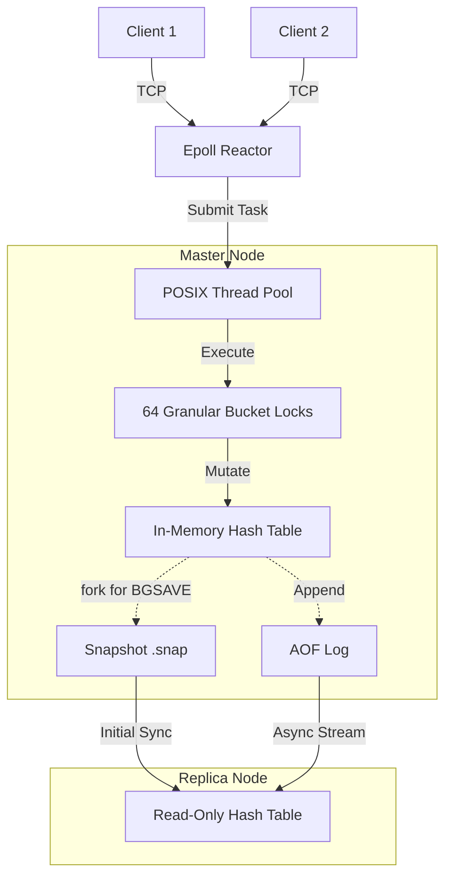

# Mini Key-Value Database Server (Mini-KV)

   

A high-performance, distributed, in-memory key-value store built entirely in C17 using strictly POSIX APIs.

## Table of Contents

- [Features](#features)
- [Architecture](#architecture)
- [Quick Start](#quick-start)
  - [Docker Compose (Recommended)](#docker-compose-recommended)
  - [Manual Build](#manual-build)
- [Performance Benchmarks](#performance-benchmarks)
- [Supported Commands](#supported-commands)
- [Internal Engine Design](#internal-engine-design)
- [License & Contribution](#license--contribution)

## Features

- **Blazing Performance:** Capable of ~53,800 QPS with sub-millisecond latency under highly concurrent loads.
- **Granular Lock Sharding:** Hash-bucket mutex lock sharding (capped at 64 locks) prevents global lock contention, ensuring high throughput.
- **Asynchronous Reactor Pattern:** Powered by an edge-triggered `epoll` event loop combined with a custom POSIX Thread Pool.
- **Robust Persistence:**
  - **BGSAVE (Snapshots):** Utilizes OS-level Copy-on-Write (COW) semantics via `fork()` for zero-downtime background snapshots.
  - **AOF (Append-Only File):** Real-time durability with background compaction (`BGREWRITEAOF`).
- **High Availability:** Master-Replica replication stream over TCP. Replicas bootstrap via binary snapshots and transition to real-time AOF streaming with read-only protection.
- **Memory Safety:** Exact byte-level memory tracking and enforcement. Zero memory leaks (verified under rigorous ASan, TSan, and Valgrind suites).
- **Cloud Native:** Fully containerized with multi-stage Docker builds and `docker-compose`.

## Architecture



## Quick Start

### Docker Compose (Recommended)

The easiest way to run a Master-Replica cluster is via Docker Compose:

```bash
# Start the cluster (1 Master, 1 Replica)
docker-compose up --build
```

The Master node will be available on port `8888`, and the Replica on port `8889`.

### Manual Build

Ensure you are running on a POSIX-compliant system (Linux, WSL2, macOS) with GCC/Clang and Make installed.

```bash
# Build the binary and test suites
make all

# Run the test suites
make test

# Start the server
./bin/mini-kv --port 8888 --workers 4
```

## Performance Benchmarks

Performance tests were conducted using the built-in benchmarking tool, issuing 100,000 requests across 16 concurrent client threads.

| Metric | Result |
| :--- | :--- |
| **Throughput (QPS)** | ~53,800 operations/sec |
| **Target Workload** | 100,000 requests |
| **Concurrency** | 16 Threads |
| **Latency** | Sub-millisecond (avg) |

## Supported Commands

| Command | Syntax | Description |
| :--- | :--- | :--- |
| **SET** | `SET <key> <value>` | Sets a string value for a given key. |
| **GET** | `GET <key>` | Retrieves the value of a key. |
| **DELETE**| `DELETE <key>` | Removes a key from the store. |
| **LPUSH** | `LPUSH <key> <value>` | Pushes a value onto the left of a list. |
| **RPOP** | `RPOP <key>` | Pops a value from the right of a list. |
| **SADD** | `SADD <key> <value>` | Adds a member to a set. |
| **SREM** | `SREM <key> <value>` | Removes a member from a set. |
| **SYNC** | `SYNC` | Initiates replication (used internally by replicas). |

## Internal Engine Design

### Copy-on-Write (COW) Snapshotting
When `BGSAVE` is triggered, the engine leverages the POSIX `fork()` system call. The child process inherits the parent's memory space and serializes the hash table to disk. Thanks to OS-level Copy-on-Write semantics, memory pages are only duplicated if the parent process modifies them during the snapshot, ensuring the `BGSAVE` operation is highly memory-efficient and non-blocking.

### Mutex Lock Sharding
Instead of using a single global lock (which causes massive thread contention under load), the internal hash table employs **lock sharding**. The hash space is divided among an array of granular bucket locks (capped at 64 locks). Threads only contend for locks when they access keys that map to the same lock shard, allowing multiple threads to safely mutate independent sections of the database in parallel.

## License & Contribution

This project is licensed under the MIT License. See the [LICENSE](LICENSE) file for details.

Contributions are welcome! Please ensure that any PRs pass the stringent ASan, TSan, and Valgrind checks by running `make asan`, `make tsan`, and `make valgrind`.
